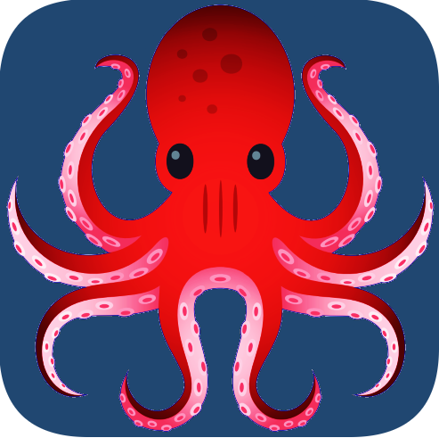

# TEXT EDITOR BUILT WITH MERN STACK

## About project
A simple colaborative text editor built with Mongoose(mongodb), Expressjs, socket.io, Reactjs, nodejs and Vite.   
Testing with Jest, SuperTest, Testing-Library.

### Built With
  
  

### clone project and install all dependencies: 

1. clone the project and cd in client and service directory:  
`npm i`  

### Commands to run client and server:
1. to run server  
`cd server && npm run dev`  
then open "http://localhost:3000/api/docs" in your browser   

2. to run client:   
`cd client && npm run dev`  
and open "http://localhost:5137/" in your browser

### testing is not done yet but:
1. to run test for server with code-coverage:     
`cd server && npm run test`  

2. to run test for client:  
`cd client && npm run test`
